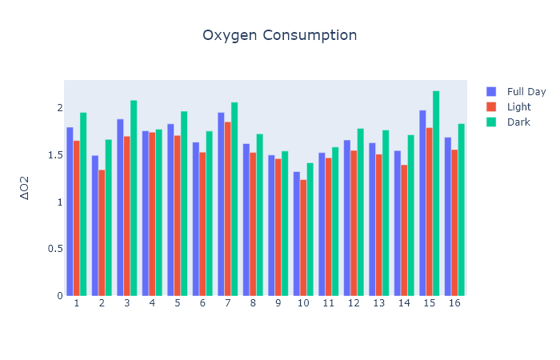
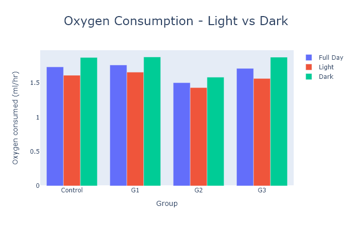

## sablepy.BarPlot

- [Parameters](#barplot)
- [Individual Cage Data](#creating-plot-for-individual-cages)
- [Group Cage Data](#average-by-group-before-creating-bar-plot)
- [Plot Customization](#customizing-the-plot)
- [Export](#export)

<strong id='barplot'>BarPlot</strong>(<b>data</b>, <b>title=Title(text=None, size=18, visible=True)</b>, <b>xaxis=XAxis(showgrid=True, text='', tickinterval=12, type='hour', visible=True)</b>, <b>yaxis=YAxis(showgrid=True, text=None, visible=True)</b>)

> Parameters

<ul style='list-style: none'>
    <li>
        <b>data : <i>sablepy.core.data.Data</i></b>
        <ul style='list-style: none'>
            <li><code>pandas.DataFrame</code> formatted specifically using <code>sablepy.average_by_circadian_cycle</code>. See the <a href="https://github.com/aeazy/SablePy/blob/main/sablepy/content/docs/math.md#average_by_circadian_cycle">documentation</a> for more information.</li>
        </ul>
    </li>
    <li>
        <b>title : <i>Title, default Title(text=None, size=18, visible=True)</i></b>
        <ul style='list-style: none'>
            <li>Expects <code>sablepy.Title</code> dataclass. See the <a href="https://github.com/aeazy/SablePy/blob/main/sablepy/content/docs/dataclasses.md#title">Title documentation</a> for more information.</li>
        </ul>
    </li>
    <li>
        <b>xaxis : <i>XAxis, default XAxis(showgrid=True, text='', tickinterval=12, type='hour', visible=True)</i></b>
        <ul style='list-style: none'>
            <li>Expects <code>sablepy.XAxis</code> dataclass. See the <a href="https://github.com/aeazy/SablePy/blob/main/sablepy/content/docs/dataclasses.md#xaxis">XAxis documentation</a> for more information.</li>
        </ul>
    </li>
    <li>
        <b>yaxis : <i>YAxis, default YAxis(showgrid=True, text=None, visible=True)</i></b>
        <ul style='list-style: none'>
            <li>Expects <code>sablepy.YAxis</code> dataclass. See the <a href="https://github.com/aeazy/SablePy/blob/main/sablepy/content/docs/dataclasses.md#yaxis">YAxis documentation</a> for more information.</li>
        </ul>
    </li>
</ul>

### Examples

#### Creating plot for individual cages:

```
df = Data(data=df)
vo2_df = df.get_channel_data("vo2")
vo2_df = average_by_circadian_cycle(vo2_df)

plot = BarPlot(vo2_df)
plot.show()
```



#### Average by group before creating bar plot:

```
df = Data(data=df)
vo2_df = df.get_channel_data("vo2").average_by_group(groups=[Group("Control", [1, 2, 3, 4]), Group("G1", [5, 6, 7, 8]), Group("G2", [9, 10, 11, 12]), Group("G3", [13, 14, 15, 16])])
vo2_df = average_by_circadian_cycle(vo2_df)

plot = BarPlot(vo2_df)
plot.show()
```


#### Customizing the plot:

```
plot = BarPlot(
    vo2_df,
    title=Title("Oxygen Consumption - Light vs Dark", size=24),
    xaxis=XAxis(text="Group"),
    yaxis=YAxis(text="Oxygen consumed (ml/hr)")
)
plot.show()
```



#### Export

- All data and plots created using `sablepy` can easily be exported using `sablepy.export`:

  ```
  plot = BarPlot(vo2_df)

  export(plot)
  ```

- See [the Export documentation](./export.md) for more information.
