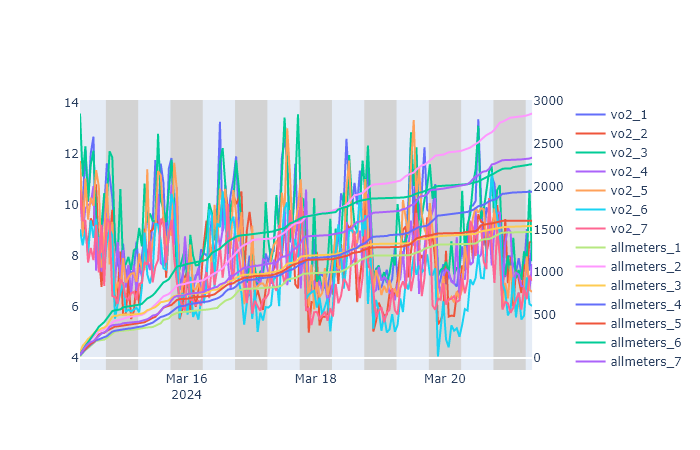

## sablepy.TimeSeries

- [Parameters](#timeseries)
- Methods:
  - [`append_data`](#append-data)
  - [`set_plot_title`](#set-plot-title)
  - [`set_xaxis_title`](#set-xaxis-title)
  - [`set_yaxis_title`](#set-yaxis-title)
  - [`set_legend_title`](#set-legend-title)
- Examples:
  - [Individual Cage Data](#creating-plot-for-individual-cages)
  - [Group Cage Data](#average-by-group-before-creating-plot)
  - [Plot Customization](#customizing-the-plot)
    - [Circadian Highlights](#circadian-highlighting)
    - [Titles](#titles)
    - [Options](#options)
    - [Annotations](#annotations)
    - [Multi-Axis](#multi-axis)
  - [Export](#export)

<hr>

### Parameters

<strong id='timeseries'>TimeSeries</strong>(<b>data</b>, <b>circadian_info=CircadianInfo(highlight=True, light_start=6, dark_start=18)</b>, <b>title=Title(text=None, size=18, visible=True)</b>, <b>xaxis=XAxis(showgrid=True, text=None, tickinterval=12, type='hour', visible=True)</b>, <b>yaxis=YAxis(showgrid=True, text=None, visible=True)</b>, <b>legend=Legend(title=None)</b>, <b>options=Options(error_bars=True, height=550, hovermode='x unified', line_style=None, showgrid=False, showlegend=True, width=1500)</b>, <b>config=Config(displayLogo=False)</b>)

> Parameters

<ul style='list-style: none'>
    <li>
        <b>data : <i>sablepy.core.data.Data | pandas.core.frame.DataFrame</i></b>
        <ul style='list-style: none'>
            <li>Accepts either a <code>sablepy.Data</code> or <code>pandas.DataFrame</code> object.</li>
        </ul>
    </li>
    <li>
        <b>circadian_info=CircadianInfo(highlight=True, light_start=6, dark_start=18) : <i>type</i></b>
        <ul style='list-style: none'>
            <li>Expects <code>sablepy.CircadianInfo</code> dataclass. See the <a href="../docs/dataclasses.md">CircadianInfo documentation</a> for more information.</li>
        </ul>
    </li>
    <li>
        <b>title : <i>Title, default Title(text=None, size=18, visible=True)</i></b>
        <ul style='list-style: none'>
            <li>Expects <code>sablepy.Title</code> dataclass. See the <a href="../docs/dataclasses.md">Title documentation</a> for more information.</li>
        </ul>
    </li>
    <li>
        <b>xaxis : <i>XAxis, default XAxis(showgrid=True, text=None, tickinterval=12, type='hour', visible=True)</i></b>
        <ul style='list-style: none'>
            <li>Expects <code>sablepy.XAxis</code> dataclass. See the <a href="../docs/dataclasses.md"> documentation</a> for more information.</li>
        </ul>
    </li>
    <li>
        <b>yaxis : <i>YAxis, default YAxis(showgrid=True, text=None, visible=True)</i></b>
        <ul style='list-style: none'>
            <li>Expects <code>sablepy.YAxis</code> dataclass. See the <a href="../docs/dataclasses.md"> YAxis documentation</a> for more information.</li>
        </ul>
    </li>
    <li>
        <b>legend : <i>Legend, default Legend(title=None)</i></b>
        <ul style='list-style: none'>
            <li>Expects <code>sablepy.Legend</code> dataclass. See the <a href="../docs/dataclasses.md"> Legend documentation</a> for more information.</li>
        </ul>
    </li>
    <li>
        <b>options : <i>Options, default Options(error_bars=True, height=550, hovermode='x unified', line_style=None, showgrid=False, showlegend=True, width=1500)</i></b>
        <ul style='list-style: none'>
            <li>Expects <code>sablepy.Options</code> dataclass. See the <a href="../docs/dataclasses.md"> Options documentation</a> for more information.</li>
        </ul>
    </li>
    <li>
        <b>config : <i>Config, default Config(displayLogo=False)</i></b>
        <ul style='list-style: none'>
            <li>Expects <code>sablepy.Config</code> dataclass. See the <a href="../docs/dataclasses.md"> Config documentation</a> for more information.</li>
        </ul>
    </li>
</ul>

### Methods

<strong id='append-data'>append_data</strong>(<b>data</b>, <b>secondary_y</b><i>=True</i>)

Append data to sablepy.TimeSeries.fig.

> Parameters

<ul style='list-style: none'>
	<li id='append_data-data'>
		<b>data : <i>Data | DataFrame</i></b>
		<ul style='list-style: none'>
			<li id='append_data-data-description'>sablepy.Data or pandas.DataFrame object.</li>
		</ul>
	</li>
</ul>
<ul style='list-style: none'>
	<li id='append_data-secondary_y'>
		<b>secondary_y : <i>bool, default True</i></b>
		<ul style='list-style: none'>
			<li id='append_data-secondary_y-description'>Wheter a secondary y-axis is plotted or not.</li>
		</ul>
	</li>
</ul>

<hr>

<strong id='set-title'>set_title</strong>(<b>text</b>)

Updates the plot's title.

> Parameters

<ul style='list-style: none'>
	<li id='set_title-text'>
		<b>text : <i>str</i></b>
		<ul style='list-style: none'>
			<li id='set_title-text-description'>String expression representing the plot title's text.</li>
		</ul>
	</li>
</ul>

<hr>

<strong id='set-xaxis-title'>set_xaxis_title</strong>(<b>text</b>)

Updates the plot's x-axis title.

> Parameters

<ul style='list-style: none'>
	<li id='set_xaxis_title-text'>
		<b>text : <i>str</i></b>
		<ul style='list-style: none'>
			<li id='set_xaxis_title-text-description'>String expression representing the x-axis title's text.</li>
		</ul>
	</li>
</ul>

<hr>

<strong id='set-yaxis-title'>set_yaxis_title</strong>(<b>text</b>)

Updates the plot's y-axis title.

> Parameters

<ul style='list-style: none'>
	<li id='set_yaxis_title-text'>
		<b>text : <i>str</i></b>
		<ul style='list-style: none'>
			<li id='set_yaxis_title-text-description'>String expression representing the y-axis title's text.</li>
		</ul>
	</li>
</ul>

<hr>

<strong id='set-legend-title'>set_legend_title</strong>(<b>text</b>)

Updates the plot's legend title.

> Parameters

<ul style='list-style: none'>
	<li id='set_legend_title-text'>
		<b>text : <i>str</i></b>
		<ul style='list-style: none'>
			<li id='set_legend_title-text-description'>String expression representing the legend title's text.</li>
		</ul>
	</li>
</ul>

<hr>

#### Creating plot for individual cages:

```
df = Data(data=df)
vo2_df = df.get_channel_data("vo2")

plot = TimeSeries(vo2_df)
plot.show()
```

<p align='center'>

</p>

#### Average by group before creating plot:

```
df = Data(data=df)
groups = [Group("Control", [1, 2, 3, 4]), Group("G1", [5, 6, 7, 8]), Group("G2", [9, 10, 11, 12]), Group("G3", [13, 14, 15, 16])]
vo2_df = df.get_channel_data("vo2").average_by_group(groups)
plot = TimeSeries(vo2_df)

plot.show()
```

<p align='center'>

</p>

#### Customizing the plot:

- ##### Circadian highlighting:

  - Specifying light and dark start times:

    ```
    plot = TimeSeries(vo2_df, circadian_info=CircadianInfo(light_start=8, dark_start=20))
    plot.show()
    ```

<p align='center'>

</p>

- Remove highlights:

  ```
  plot = TimeSeries(vo2_df, circadian_info=CircadianInfo(False))
  plot.show()
  ```

    <p align='center'>
    
    </p>

- ##### Titles:

  - Modify plot title text and size, X/Y Axis text, and legend title
  - Specify X-Axis interval (default is 12), as well as switch to 'timestamps' for the X-Axis labels

  ```
  plot = TimeSeries(
  vo2_df,
  title=Title(text="Average Oxygen Consumed", size=24),
  xaxis=XAxis(tickinterval=5, type="timestamps"),
  yaxis=YAxis(text="Oxygen Consumption (ml/hr)"),
  legend=Legend(title="Group"),
  )
  ```

    <p align='center'>
    
    </p>

- ##### Options:

  - Disable error bars display
  - Modify color and style of lines in the plot

  ```
  plot = TimeSeries(
  vo2_df,
  options=Options(error_bars=False, line_style={'G3':Line(color='black', dash='dashdot')})
  )
  ```

    <p align='center'>
    
    </p>

- ##### Annotations

  - Adding text annotations using `add_annotation`:

    ```
    plot = TimeSeries(df)
    plot.add_annotation("Annotation #1", x=6)
    plot.add_annotation("Annotation #2", x=12, showarrow=False)
    plot.add_annotation("Annotation #3", x=18, yshift=20, showarrow=False)
    plot.add_annotation("Annotation #4", x=24, arrowcolor='red', textcolor='red')
    ```

    <p align='center'>
    
    </p>

    - Add vertical lines using `add_vline`:

    ```
    plot.add_vline(12)
    plot.add_vline(18,  label="Label #1", line_color='red', textcolor='red')
    plot.add_vline(24,  line_color='red', line_dash='dash')
    ```

    <p align='center'>
    
    </p>

    - Add horizontal lines using `add_hline`:

    ```
    plot = TimeSeries(df)
    plot.add_hline(y="max", label="Max", align_label="right")
    plot.add_hline(y="mean", label="Mean", line_color="red", textcolor="red", line_width=2)
    plot.add_hline(y="min", label="Min", line_dash="dash")
    plot.add_hline(y=2.4, label="Defined Y", yshift=-1, xshift=100, showarrow=True)
    ```

    <p align='center'>
    
    </p>

    - See [the docs](../docs/annotations.md) for more information!

- ##### Multi-Axis

  - A multi-axis plot can be generated by appending a second data object to the TimeSeries object:

    ```
    plot = TimeSeries(df)
    d = data.get_channel_data("vo2")
    d2 = data.get_channel_data("allmeters")
    plot = TimeSeries(d).append_data(d2)
    ```

    <p align='center'>
    
    </p>

#### Export

- All data and plots created using `sablepy` can be exported using `sablepy.export`:

  ```
  plot = TimeSeries(vo2_df)

  export(plot)
  ```

- See [the Export documentation](./export.md) for more information.
